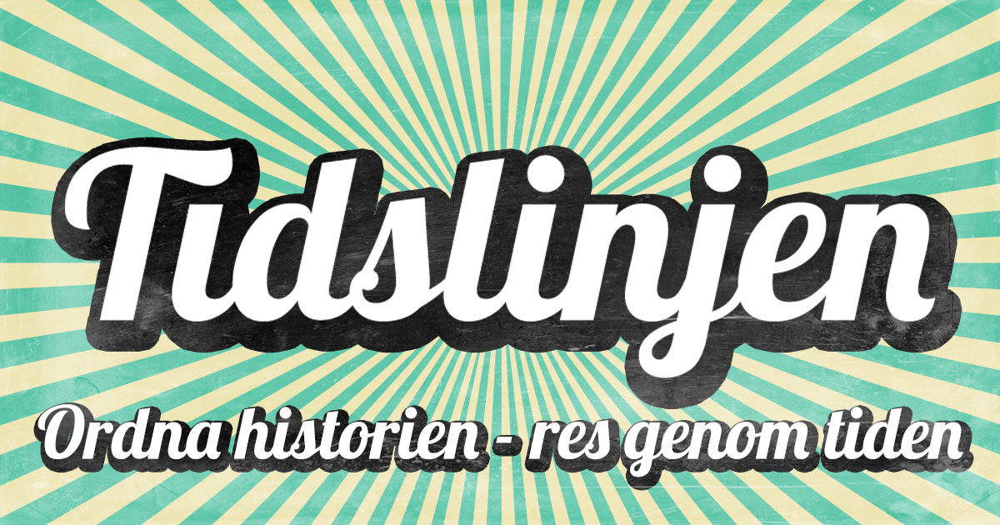

# Welcome to the Timeline

_The Timeline - arrange time, travel through history_

This is a simple yet fun game trying to place historic events or songs in correct order. You may only play one historic game and one musical game per day - wordl style. Top ten games will be featured on the weekly highscore list so you can brag to your friends - **no cheating**!

_Currently only in Swedish_

Try it out on https://tidslinjen.app

## Rules

The main goal is to place your current historic event in the correct order relative to the other you have by guessing what year the given event happened.
Nailing or being close gives you bonus points.

The game ends when your guess isn't chronologically correct.

### Example

You have one historic event previously, 1950,
and you have to guess what year the moon-landing occured (which was in 1969).

If you guess _before_ 1950 the game would end.
If you guess _after_ 1950 you would be awarded atleast one point, if you guess close to, or spot on, you get bonus points and the game continues. For the next event you have **2** events to factor in, 1950 and 1969. So the game gets harder and harder for each correct answer

## Installation

- Install bun
- Install firebase-tools https://firebase.google.com/docs/cli
  - Setup firestore emulator running on `localhost:8080`
- Install dependencies `bun install``

### Development

Run these commands simultaneously

- `bun dev`
- `firebase emulators:start`

## Disclaimer

The song previews and cover arts from Spotify included in this content are utilized under the principles of fair use for the purpose of teaching and research
